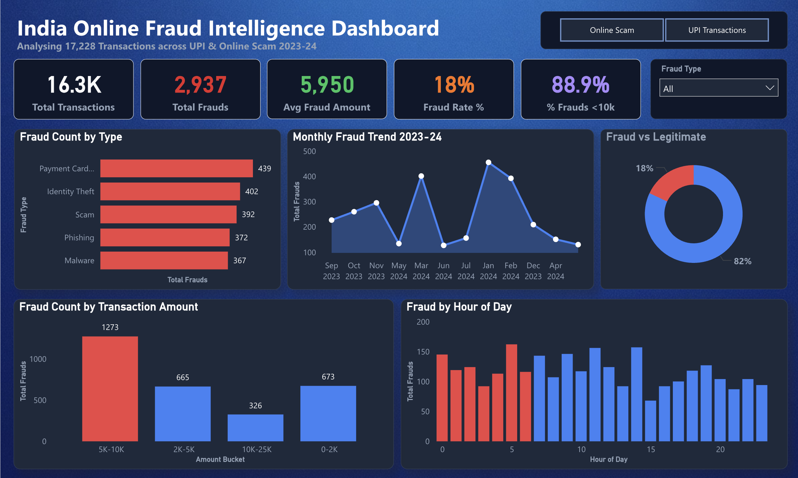
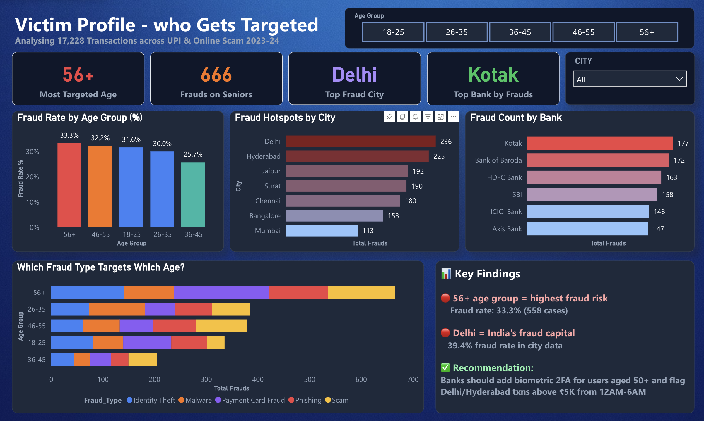

# India Online Fraud Intelligence Dashboard

This repository contains a Power BI dashboard designed for analyzing and visualizing online fraud and scam data across India. It provides insights into the nature, scale, and types of digital fraud happening using comprehensive datasets.

## Project Files
- **`int387_final.pbix`**: The main Power BI project file containing the dashboard, visualizations, and data models.
- **Datasets**: 
  - `Updated_Inclusive_Indian_Online_Scam_Dataset (1).csv`
  - `synthetic_indian_upi_fraud_data.csv`

## Dashboard Previews

### Page 1

### Page 2
